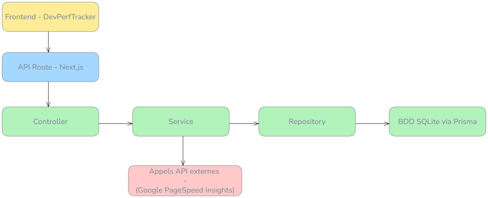

# Architecture
## Projet monolithique
L'application DevPerfTracker repose sur une architecture monolithique intégrée au sein de Next.js App Router permettant de regrouper Frontend et Backend API Routes dans un même projet.
---
## Schéma découpage 

---
## Liste et rôles des Design Patterns utilisés
| Pattern                                | Rôle                                                                                                 |
| -------------------------------------- | ---------------------------------------------------------------------------------------------------- |
| **Component-Based Architecture**       | Modularise chaque partie de l’interface pour garantir une réutilisabilité maximale.                  |
| **Container / Presentational Pattern** | Isole la logique métier des composants visuels pour séparer les responsabilités.                     |
| **Command Pattern**                    | Encapsule les actions utilisateur (analyse, affichage) pour mieux gérer les événements.              |
| **Singleton (état centralisé)**        | Centralise les données partagées comme l’historique ou les résultats dans un point unique.           |
| **Repository Pattern (Backend)**       | Interpose une couche d'abstraction entre la base de données (Prisma) et les services métiers.        |
| **Service Layer**                      | Sépare la logique métier de la logique de contrôle pour assurer la testabilité et la maintenabilité. |

---

## Explication des responsabilités de chaque couche
| Couche                         | Rôle                                                                                                   |
| ------------------------------ | ------------------------------------------------------------------------------------------------------ |
| **Frontend (React + Next.js)** | Affiche les formulaires, graphiques et résultats d’analyse. Communique avec l'API interne.             |
| **API Route (Next.js)**        | Point d’entrée HTTP pour les appels depuis le frontend. Redirige vers les bons contrôleurs.            |
| **Controller**                 | Valide les inputs, gère les erreurs, orchestre les services et décide des réponses à retourner.        |
| **Service Layer**              | Exécute la logique métier : appel à Google PageSpeed, transformation des résultats, traitement métier. |
| **Repository Layer**           | Gère la persistance des données avec **Prisma** (SQLite) et isole l’accès à la base de données.        |
| **Base de données**            | Stocke les résultats d’analyses avec horodatage, score global et métriques détaillées.                 |

---
## Justification des choix techniques

| Catégorie            | Optimisation mise en place ou prévue                                     | Impact attendu                                            |
|----------------------|-------------------------------------------------------------------------|-----------------------------------------------------------|
| UI & Accessibilité | Utilisation de **shadcn/ui** et **Tailwind CSS** pour un rendu léger et responsive | Meilleure expérience utilisateur, accessibilité renforcée |
| Performance        | Chargement des composants par onglet (Tabs)                             | Moins de rendu inutile, meilleure réactivité               |
| Réutilisabilité    | Décomposition en composants réutilisables (`AnalyzeForm`, `AnalysisResult`, etc.) | Maintenance facilitée, scalabilité                        |
| API & BDD         | API optimisée (une seule requête par action) + SQLite Prisma             | Rapidité d’accès aux données et légèreté                   |
| Graphiques        | Utilisation de **Recharts** pour des visualisations claires et performantes | Analyse rapide et impact visuel fort                       |
---